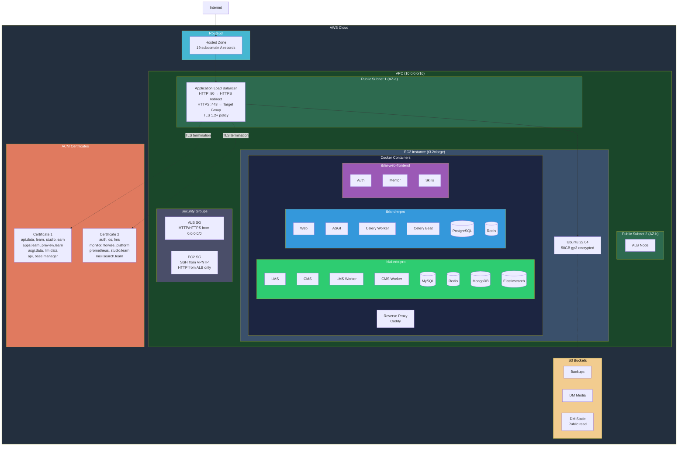
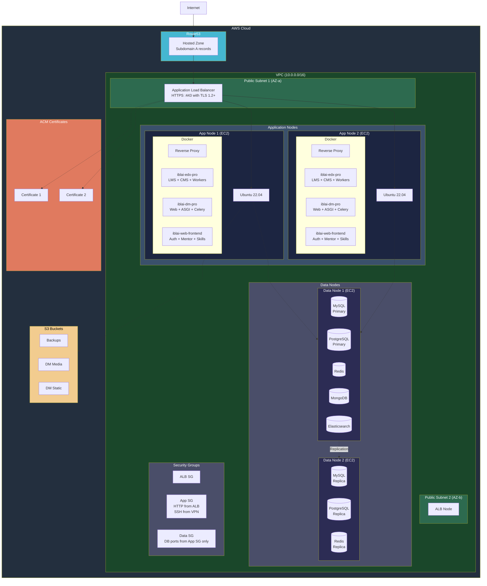

# iblai-infra-ops Architecture

## Single Server — AWS Infrastructure



## Multi Server — AWS Infrastructure



## Provisioning & Setup Flow

```mermaid
flowchart TB
    subgraph CLI["iblai-infra-ops"]
        A[iblai infra provision] --> P1[AWS Credentials]
        P1 --> P2[Project & Compute Config]
        P2 --> P3[Network & SSH]
        P3 --> P4[Domain & Certificates]
        P4 --> P5[Review & Confirm]
    end

    subgraph TF["Terraform (AWS Infrastructure)"]
        P5 --> TF1[VPC + Subnets]
        TF1 --> TF2[Security Groups]
        TF2 --> TF3[EC2 Instance]
        TF3 --> TF4[Application Load Balancer]
        TF4 --> TF5[S3 Buckets]
        TF5 --> TF6[ACM Certificates]
        TF6 --> TF7[Route53 DNS Records]
        TF7 --> TF8[HTTPS Listener]
    end

    subgraph SETUP["Ansible (Platform Setup)"]
        TF8 --> S1[Setup Prompts]
        S1 --> S2[SSH Verify]
        S2 --> S3[Ansible Runner]
    end

    subgraph ANSIBLE["Ansible Playbook (9 Roles)"]
        S3 --> R1

        subgraph INFRA_ROLES["Infrastructure Roles"]
            R1["1. Docker Engine"]
            R1 --> R2["2. AWS CLI Setup"]
            R2 --> R3["3. Python Virtual Env"]
            R3 --> R4["4. iblai-cli-ops"]
        end

        subgraph CONFIG_ROLE["Platform Configuration"]
            R4 --> R5["5. Platform Config"]
        end

        subgraph SERVICE_ROLES["Service Launch Roles"]
            R5 --> R6["6. iblai-dm-pro"]
            R6 --> R7["7. iblai-edx-pro"]
            R7 --> R8["8. iblai-web-frontend"]
            R8 --> R9["9. Final Steps"]
        end
    end

    style CLI fill:#1a1a2e,color:#fff
    style TF fill:#16213e,color:#fff
    style SETUP fill:#0f3460,color:#fff
    style ANSIBLE fill:#533483,color:#fff
    style INFRA_ROLES fill:#2c2c54,color:#fff
    style CONFIG_ROLE fill:#2c2c54,color:#fff
    style SERVICE_ROLES fill:#2c2c54,color:#fff
```



## Containers Per Role


## Render These Diagrams

```bash
# Using mermaid-cli
npx @mermaid-js/mermaid-cli -i docs/architecture.md -o docs/architecture.png

# Or just view on GitHub — Mermaid renders natively in .md files
```
