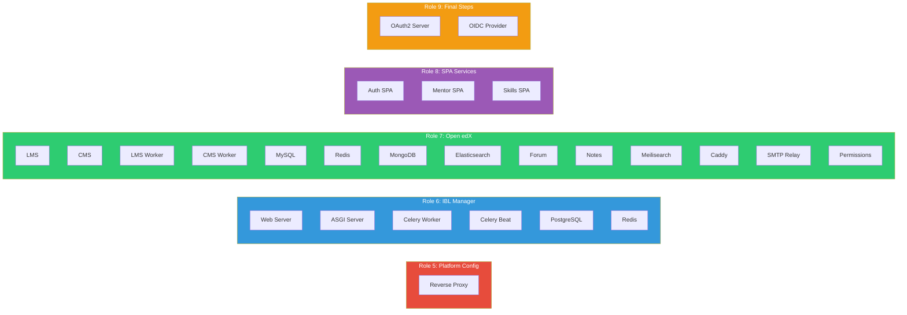
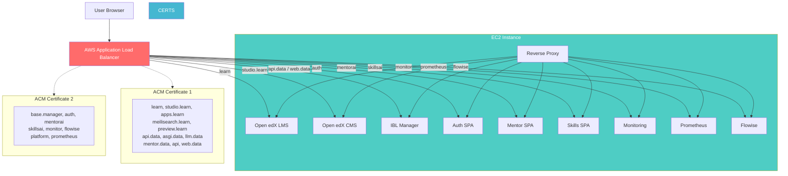

# IBLAI Infra Architecture

## Full Provisioning & Setup Flow

```mermaid
flowchart TB
    subgraph CLI["IBLAI INFRA CLI"]
        A[iblai infra provision] --> P1[AWS Credentials]
        P1 --> P2[Project & Compute Config]
        P2 --> P3[Network & SSH]
        P3 --> P4[Domain & Certificates]
        P4 --> P5[Review & Confirm]
    end

    subgraph TF["TERRAFORM (Phase 1: AWS Infrastructure)"]
        P5 --> TF1[VPC + Subnets + IGW]
        TF1 --> TF2[Security Groups]
        TF2 --> TF3[EC2 Instance - Ubuntu 22.04]
        TF3 --> TF4[Application Load Balancer]
        TF4 --> TF5[S3 Buckets - backups, media, static]
        TF5 --> TF6[ACM Certificates + DNS Validation]
        TF6 --> TF7[Route53 Records - 19 subdomains]
        TF7 --> TF8[HTTPS Listener + TLS 1.2]
    end

    subgraph SETUP["iblai infra setup (Phase 2)"]
        TF8 --> S1[Setup Prompts]
        S1 -->|SetupConfig| S2[SSH Verify]
        S2 --> S3[AnsibleRunner]
    end

    subgraph ANSIBLE["ANSIBLE PLAYBOOK (9 Roles on EC2)"]
        S3 --> R1

        subgraph INFRA_ROLES["Infrastructure Roles"]
            R1["1. Docker\nEngine + Compose + apache2-utils"]
            R1 --> R2["2. AWS CLI\nInstall + configure credentials"]
            R2 --> R3["3. Python\npyenv + Python 3.11.8 + venv"]
            R3 --> R4["4. ibl_cli_ops\nClone repo + pip install"]
        end

        subgraph CONFIG_ROLE["Platform Configuration"]
            R4 --> R5["5. ibl_platform\nchown /ibl/ → ubuntu\nConfigure domain, images, AI\nSet edX service image defaults\nLaunch reverse proxy\nCreate docker network\nGenerate Langfuse secrets\nECR login"]
        end

        subgraph SERVICE_ROLES["Service Launch Roles"]
            R5 --> R6["6. ibl_dm\nchown postgres data → UID 999\nibl dm launch"]
            R6 --> R7["7. ibl_edx\nibl edx launch"]
            R7 --> R8["8. ibl_spa\nGenerate OAuth2 creds\nCreate OAuth app in edX\nConfigure SPA settings\nLaunch Auth, Mentor, Skills SPAs"]
            R8 --> R9["9. final_steps\nibl launch --ibl-oauth --ibl-oidc\nibl dm auth-setup"]
        end
    end

    style CLI fill:#1a1a2e,color:#fff
    style TF fill:#16213e,color:#fff
    style SETUP fill:#0f3460,color:#fff
    style ANSIBLE fill:#533483,color:#fff
    style INFRA_ROLES fill:#2c2c54,color:#fff
    style CONFIG_ROLE fill:#2c2c54,color:#fff
    style SERVICE_ROLES fill:#2c2c54,color:#fff
```



## Containers Launched Per Role



## Network & DNS Architecture



## Render This Diagram

```bash
# Using mermaid-cli
npx @mermaid-js/mermaid-cli -i docs/architecture.md -o docs/architecture.png

# Or just view on GitHub — Mermaid renders natively in .md files
```
